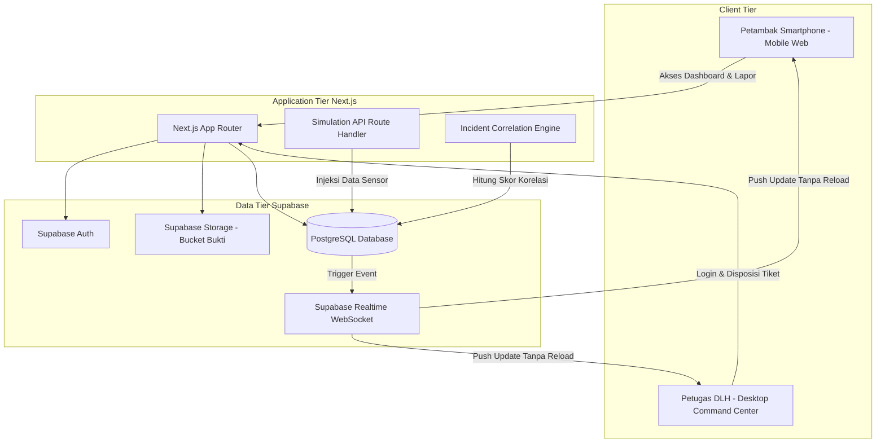

# Product Requirement Document (PRD)

## AquaGuard Coastal: Smart Coastal EWS & Illegal Dumping Response Platform

* **Document Version**: 1.0.0
* **Target Milestone**: Hackathon IT Competition 2026 (Smart City Theme)
* **Status**: Approved & Aligned

---

## 1. Executive Summary & Value Proposition

### 1.1 Latar Belakang & Problem Statement
* **Ancaman Ganda Pesisir**: Daerah pesisir dan kawasan tambak budidaya kerap menghadapi ancaman serentak: luapan banjir ROB dan lonjakan tingkat keasaman air akibat pembuangan limbah industri cair ilegal ke laut lepas. Saat air pasang ROB naik, air laut yang telah tercemar limbah asam terdorong masuk ke saluran irigasi tambak, menyebabkan kematian massal benur (udang/ikan) dalam hitungan jam.
* **Respon EWS Konvensional Pasif**: Sistem pemantauan yang ada saat ini umumnya hanya bersifat dashboard pasif tanpa mekanisme peringatan darurat proaktif (*proactive push alert*), padahal banjir ROB sering memuncak pada tengah malam atau dini hari saat petambak tidak sedang memantau layar.
* **Gap Penegakan Hukum & Laporan Warga**: Petambak yang menyaksikan pembuangan limbah sering kali tidak memiliki kanal pelaporan yang cepat, transparan, dan terhubung langsung ke Dinas Lingkungan Hidup (DLH). Di sisi lain, DLH kesulitan membuktikan korelasi antara laporan warga dengan bukti pencemaran di lapangan.

### 1.2 Solusi Produk
AquaGuard Coastal adalah platform respons pencemaran dan sistem peringatan dini pesisir berbasis web responsif yang menghubungkan petambak garda depan dengan Dinas Lingkungan Hidup (DLH). Sistem ini mengintegrasikan:
1. **Live EWS Telemetry & Actionable Guidance**: Pemantauan pH air, ketinggian pasang ROB, dan salinitas dengan maklumat aksi fisik instan (misal: *"Tutup Pintu Air Primer Segera"*).
2. **Proactive Push Notification**: Simulasi pengiriman peringatan dini otomatis ke perangkat pengguna saat ambang batas kritis terlampaui.
3. **Zero-Friction Citizen Reporting**: Pelaporan indikasi pencemaran limbah dengan bukti foto dan auto-geolocation tanpa hambatan login akun, dilengkapi verifikasi kontak WhatsApp untuk mencegah spam.
4. **Smart Incident Correlation Engine**: Mesin analitik di sisi DLH yang otomatis mengkorelasikan laporan foto warga dengan penurunan pH sensor terdekat dan waktu pasang ROB, membentuk radius *"Zona Bahaya Tambak"*.
5. **Government GIS Command Center**: Dashboard desktop untuk triase laporan warga, disposisi petugas lapangan, dan pelacakan status tiket secara transparan.

---

## 2. Target User Personas & Core Journeys

### Persona A: Pak Sugeng (Petambak Pesisir / Publik)
* **Kebutuhan**: Mengetahui kondisi air secara instan sebelum membuka pintu air tambak; menerima alert bahaya di ponsel saat malam hari; dapat melaporkan buangan limbah mencurigakan tanpa ribet mengisi form login.
* **Perangkat**: Smartphone Android, penggunaan di luar ruangan di bawah sinar matahari langsung (*high ambient glare*).
* **Alur Perjalanan**:
  1. Menerima Push Alert / membuka dashboard publik AquaGuard tanpa login.
  2. Membaca banner status waspada dan telemetri pH/ROB yang kontras tinggi.
  3. Mengambil tindakan pengamanan tambak (menutup pintu air).
  4. Mengambil foto saluran air yang tercemar lalu menekan tombol *"Lapor Insiden"*.
  5. Sistem otomatis membaca koordinat GPS; Pak Sugeng memasukkan nomor WhatsApp dan deskripsi singkat.
  6. Menerima Kode Tiket (misal: `#TK-2026-081`) dan memantau status penanganan oleh dinas kapan saja via menu lacak tiket.

### Persona B: Sdr. Hendra (Pengawas Lingkungan Hidup / DLH)
* **Kebutuhan**: Memantau seluruh titik sensor pesisir secara spasial; memvalidasi laporan warga; memiliki bukti korelasi data untuk dasar penindakan pabrik pembuang limbah ilegal; mendisposisikan tugas ke tim PPNS lapangan.
* **Perangkat**: Laptop / PC Desktop di Command Center dinas.
* **Alur Perjalanan**:
  1. Login ke Command Center melalui otentikasi resmi.
  2. Melihat Peta GIS interaktif yang menunjukkan status sensor dan poligon dispersi limbah (*Spill Impact Zone*).
  3. Menerima notifikasi tiket laporan baru dengan skor korelasi otomatis (*"Korelasi 94% dengan Sensor Node A-04"*).
  4. Meninjau foto bukti lapangan dan titik koordinat warga.
  5. Memperbarui status tiket, menuliskan catatan investigasi, dan mendisposisikan tim patroli lapangan.
  6. Pelapor otomatis menerima pembaruan status bahwa laporan telah ditindaklanjuti.

---

## 3. Fitur Utama & Spesifikasi Fungsional

### 3.1 Modul Publik / Petambak (Mobile-First, No Login Required)

| ID Fitur | Nama Fitur | Spesifikasi Kebutuhan |
| :--- | :--- | :--- |
| **PUB-01** | **Live Telemetry & Status Banner** | Menampilkan metrik utama: Keasaman Air (pH), Ketinggian Pasang ROB (cm), dan Salinitas (ppt). Banner darurat solid amber/merah dengan direktif aksi fisik instan berbasis aturan threshold: <br>- Normal: pH 6.5 - 8.5 & ROB < 120 cm <br>- Waspada: pH 5.5 - 6.4 ATAU ROB 120 - 150 cm <br>- Bahaya: pH < 5.5 ATAU ROB > 150 cm |
| **PUB-02** | **Proactive EWS Alert** | Sakelar toggle untuk mengaktifkan Web Push Notifications atau simulasi notifikasi WhatsApp EWS pada perangkat pengguna saat terdeteksi status Waspada/Bahaya. |
| **PUB-03** | **Historical Trend Chart** | Visualisasi grafik garis 6-24 jam terakhir yang menampilkan fluktuasi penurunan pH terhadap garis batas aman benur. |
| **PUB-04** | **Zero-Friction Reporting** | Formulir pelaporan limbah cepat: <br>- Upload foto bukti (kamera/galeri, kompresi client-side). <br>- Auto-detect Geolocation GPS via HTML5 Geolocation API dengan validasi radius pesisir. <br>- Input nomor WhatsApp aktif untuk verifikasi kontak petugas. <br>- Deskripsi singkat insiden. <br>- Client-side rate limiting untuk mencegah pengiriman berulang. |
| **PUB-05** | **Public Ticket Tracking** | Halaman pencarian status laporan menggunakan Kode Tiket unik tanpa login akun. Menampilkan status tahapan: `Diterima`, `Verifikasi Data`, `Investigasi Lapangan`, dan `Selesai / Ditindak`. |

### 3.2 Modul Pemerintah / DLH Command Center (Desktop, Protected Access)

| ID Fitur | Nama Fitur | Spesifikasi Kebutuhan |
| :--- | :--- | :--- |
| **GOV-01** | **Secure Authentication** | Autentikasi petugas dinas menggunakan Supabase Auth (Email & Password). |
| **GOV-02** | **GIS Spatial Map** | Peta interaktif berbasis Leaflet yang memvisualisasikan layer: <br>- Titik Buoy Sensor (hijau/kuning/merah). <br>- Marker Titik Laporan Warga dengan thumbnail foto bukti. <br>- Marker Lokasi Outfall Pembuangan Industri Pesisir. <br>- Poligon dinamis radius sebaran limbah (*Incident Correlation Zone*). |
| **GOV-03** | **Incident Correlation Engine** | Algoritma cerdas yang menghitung skor korelasi insiden berdasarkan: <br>1. Jarak radius laporan warga terhadap sensor yang mengalami penurunan pH (< 2 km). <br>2. Selisih waktu kejadian (< 60 menit). <br>3. Status kenaikan pasang air ROB. <br>Menghasilkan skor persentase korelasi (misal: 94%) untuk mendukung validasi hukum. |
| **GOV-04** | **Ticketing & Field Dispatch** | Manajemen tiket laporan warga: filter status (`Pending`, `Investigasi`, `Selesai`), peninjauan foto bukti, input catatan lapangan pengawas PPNS, dan pengubahan status tiket. |
| **GOV-05** | **Demo Simulation Controller** | Panel kontrol demo juri untuk memicu injeksi skenario simulasi: <br>- Tombol `Simulasi Lonjakan Limbah Asam` (pH turun drastis ke 5.2). <br>- Tombol `Simulasi Puncak ROB` (ketinggian air naik ke 155 cm). <br>- Tombol `Reset Normal` (pH 7.4, ROB 85 cm). <br>Perubahan state tersinkronisasi seketika ke dashboard publik via WebSocket. |

---

## 4. Technical Architecture & Tech Stack

### 4.1 Technology Stack Matrix
* **Frontend Framework**: Next.js 14+ (App Router, TypeScript).
* **Styling & Components**: Tailwind CSS + shadcn/ui. Kepatuhan mutlak pada [DESIGN.md](file:///d:/Lomba/Hackathon%20IT%20Comp/DESIGN.md) (100% warna solid datar, tanpa gradien, tanpa emoji, border 1px tegas).
* **State & Realtime Sync**: React Hooks + Supabase Realtime (WebSocket `postgres_changes`).
* **Database & BaaS**: Supabase (PostgreSQL, Supabase Storage untuk foto bukti, Supabase Auth).
* **Mapping Engine**: Leaflet JS + OpenStreetMap via `react-leaflet`.
* **Data Visualization**: Chart.js via `react-chartjs-2`.

### 4.2 High-Level Architecture Diagram



---

## 5. Database Schema (PostgreSQL / Supabase)

### 5.1 Tabel `sensor_nodes`
Menyimpan identitas buoy sensor yang terpasang di wilayah pesisir.
```sql
CREATE TABLE sensor_nodes (
    id UUID PRIMARY KEY DEFAULT gen_random_uuid(),
    sensor_code VARCHAR(30) UNIQUE NOT NULL,      -- Contoh: 'NODE-DELTA-01'
    location_name VARCHAR(100) NOT NULL,          -- Contoh: 'Muara Tambak Sektor Timur'
    latitude DOUBLE PRECISION NOT NULL,           -- Contoh: -7.1245
    longitude DOUBLE PRECISION NOT NULL,          -- Contoh: 112.7891
    is_active BOOLEAN DEFAULT TRUE,
    created_at TIMESTAMPTZ DEFAULT NOW()
);
```

### 5.2 Tabel `sensor_telemetry_logs`
Menyimpan riwayat aliran data telemetri berkala dari sensor fisik atau simulasi.
```sql
CREATE TABLE sensor_telemetry_logs (
    id UUID PRIMARY KEY DEFAULT gen_random_uuid(),
    sensor_id UUID REFERENCES sensor_nodes(id) ON DELETE CASCADE,
    ph_level NUMERIC(4,2) NOT NULL,               -- Contoh: 5.40
    water_level_cm NUMERIC(5,1) NOT NULL,         -- Contoh: 138.0
    salinity_ppt NUMERIC(4,1) NOT NULL,           -- Contoh: 22.5
    status VARCHAR(20) NOT NULL,                  -- 'SAFE', 'WARNING', 'DANGER'
    action_directive TEXT NOT NULL,               -- Maklumat aksi yang direkomendasikan
    recorded_at TIMESTAMPTZ DEFAULT NOW()
);
CREATE INDEX idx_telemetry_sensor_time ON sensor_telemetry_logs(sensor_id, recorded_at DESC);
```

### 5.3 Tabel `incident_reports`
Menyimpan data tiket laporan insiden pencemaran dari warga.
```sql
CREATE TABLE incident_reports (
    id UUID PRIMARY KEY DEFAULT gen_random_uuid(),
    ticket_code VARCHAR(30) UNIQUE NOT NULL,      -- Contoh: 'TK-2026-0925-081'
    reporter_phone VARCHAR(20) NOT NULL,          -- Contoh: '+6281278901234'
    description TEXT NOT NULL,
    image_url TEXT NOT NULL,                      -- URL Supabase Storage
    latitude DOUBLE PRECISION NOT NULL,
    longitude DOUBLE PRECISION NOT NULL,
    status VARCHAR(20) DEFAULT 'PENDING',         -- 'PENDING', 'INVESTIGATING', 'RESOLVED'
    priority VARCHAR(10) DEFAULT 'MEDIUM',        -- 'LOW', 'MEDIUM', 'HIGH'
    correlation_score INTEGER DEFAULT 0,          -- 0 - 100 (%)
    correlated_sensor_id UUID REFERENCES sensor_nodes(id),
    officer_notes TEXT,
    created_at TIMESTAMPTZ DEFAULT NOW(),
    updated_at TIMESTAMPTZ DEFAULT NOW()
);
CREATE INDEX idx_reports_status ON incident_reports(status);
```

### 5.4 Tabel `alert_subscriptions`
Menyimpan token push notifikasi dan nomor kontak petambak untuk simulasi broadcast EWS.
```sql
CREATE TABLE alert_subscriptions (
    id UUID PRIMARY KEY DEFAULT gen_random_uuid(),
    phone_number VARCHAR(20),
    coastal_sector VARCHAR(50) NOT NULL,
    is_active BOOLEAN DEFAULT TRUE,
    created_at TIMESTAMPTZ DEFAULT NOW()
);
```

---

## 6. API Specification & Simulation Engine

### 6.1 `GET /api/sensors/live`
Mengambil data kondisi terkini seluruh titik sensor pesisir.
```json
{
  "status": "success",
  "data": [
    {
      "sensor_code": "NODE-DELTA-01",
      "location_name": "Muara Tambak Sektor Timur",
      "latitude": -7.1245,
      "longitude": 112.7891,
      "latest_telemetry": {
        "ph_level": 5.4,
        "water_level_cm": 138,
        "salinity_ppt": 22.0,
        "status": "WARNING",
        "action_directive": "Tutup pintu air primer tambak segera! Terdeteksi anomali keasaman air laut.",
        "recorded_at": "2026-09-27T10:15:00Z"
      }
    }
  ]
}
```

### 6.2 `POST /api/simulation/trigger`
Endpoint internal untuk demo hackathon yang memicu pembaruan state ke database Supabase.
* **Payload Request**:
```json
{
  "scenario": "ACID_SPILL_ROB", 
  "sensor_code": "NODE-DELTA-01",
  "ph_override": 5.2,
  "water_level_override": 148
}
```
* **Efek Sistem**: Data baru ditulis ke tabel `sensor_telemetry_logs`, memicu event `INSERT` di Supabase Realtime, dan seketika memperbarui tampilan dashboard petambak dan admin tanpa reload.

### 6.3 `POST /api/reports/submit`
Endpoint publik untuk pengiriman laporan warga.
* **Payload**: `Multipart/form-data` (foto bukti, deskripsi, latitude, longitude, reporter_phone).
* **Logic**:
  1. Validasi koordinat wajib berada dalam radius wilayah pesisir yang ditentukan.
  2. Upload foto ke Supabase Storage bucket `incident-proofs`.
  3. Hitung korelasi dengan sensor terdekat melalui algoritma spasial.
  4. Generate kode tiket acak format `TK-YYYY-XXXX`.
  5. Simpan record ke database dan kembalikan kode tiket ke warga.

---

## 7. Desain Sistem & Aturan Antarmuka

Mengacu penuh pada file [DESIGN.md](file:///d:/Lomba/Hackathon%20IT%20Comp/DESIGN.md):
* **Palet Warna Terbatas**:
  * Primary: `#1257bb`
  * Deep Navy: `#102e91`
  * Safe Mint: `#b5e6c5` (teks `#065f46`)
  * Warning Amber: `#f0c059` (teks `#102e91`)
  * Teal: `#54b7b0`
  * Canvas: `#f8fafc` | Card: `#ffffff` | Border: `#e2e8f0`
* **Zero Gradients**: Seluruh kartu, latar belakang, dan tombol berbentuk flat padat.
* **Zero Emojis**: Menggunakan ikon geometri monoline SVG dan tipografi monospace.
* **Touch Targets**: Tombol mobile minimal `48px` untuk kemudahan navigasi di lapangan.

---

## 8. Non-Functional Requirements (NFR) untuk Hackathon

1. **Stabilitas Live Demo (Offline-Resilience & Seed Data)**:
   * Menyediakan script seeding otomatis (`npm run seed`) untuk mengisi data awal sensor dan riwayat tiket laporan yang realistis.
   * Mekanisme fallback lokal jika koneksi Supabase lambat saat penjurian (menggunakan local mock state).
2. **Keterbacaan Luar Ruangan (High Contrast)**:
   * Seluruh komponen dashboard petambak wajib lolos uji kontras rasio WCAG AAA untuk keterbacaan di bawah terik matahari.
3. **Kecepatan Muat (Performance)**:
   * Halaman publik petambak harus memiliki skor Lighthouse Performance > 90 dengan bundle size yang ringkas.
4. **Kejelasan Nilai Smart City**:
   * Sistem harus dengan jelas mendemonstrasikan transisi digital dari monitoring pasif menjadi penindakan proaktif berbasis korelasi data.
